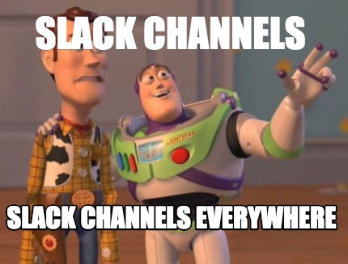
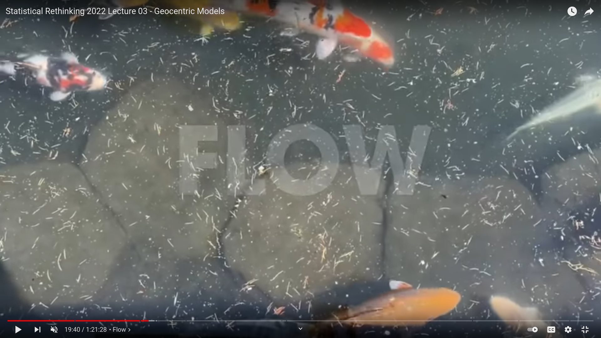

# Geospatial health

## Why? 

- Tremendous improvements and new technologies to display spatial informations (vector tiles) 

- Increase of spatial data (new iphone has LIDAR for point data cloud)

BUT!

**Personnal view**: "Looking at the map"  is still our main way of doing spatial data analysis  

It is good but not enough! 


### About the book 

Author : **Paula Moraga**   
- Web site: https://www.paulamoraga.com/  
- Twitter: https://twitter.com/Paula_Moraga_  


3 parts: 

  1. Geospatial health data and INLA: 4 chapters to introduce concepts and tools to process geospatial health data 
  
  2. Modeling and visualization: 6 chapters with a focus on **modeling** (Aeral data, geostatistical data) and visualization (mostly for EDA) 
  
  3. Communication of results: 6 chapters with a focus on communication with web tools (Shiny + dashboards)
  


## How?

### Check/use R4ds Slack 

- Tour of Slack 
  - You can exchange, share links of references and ask questions 
  - You have pinned all the link of this book club (planning, github repo, etc)  
  - Do not forget to be kind!



### Using Git and Github 

Git: version control as a DAG  

GitHub: company that host remote git and way more! 

You will have: 

- a repository in your computer with git initialize 

- a remote repository in your GH account (linked to your local repository)

- a link with the R4DS `bookclub-geohealth` GH repository 

#### Set up 

1. Install git
2. Introduce yourself to git
3. Having a GitHub (GH) account  
4. Link GH and Rstudio (optional but make stuff way more easy!)  

Then you can follow R4DS workflow

My workflow: 

- Fork in GH
- Create a new **project** with Rstudio (with Version control)
- Configure `upstream` : see  https://happygitwithr.com/fork-and-clone.html#fork-and-clone-without-usethis

### Following the flow 



Source: Richard McElreath (http://www.youtube.com/watch?v=zYYBtxHWE0A&t=1180s)

## Geospatial health

> In general, descriptive methods are the basis of routine reporting of surveillance data. These focus on the **observed patterns** in the data and might also seek to compare the relative occurrence of health outcomes in different subgroups. More specialized hypotheses are explored using **inferential methods**. The aim of these methods is to make statistical conclusions about the patterns or outcomes of health.

One classic historical example: Jon Snow (Cholera). 

If you are interested: https://cran.r-project.org/web/packages/HistData/

### Disease mapping

Bayesian hierarchical models : 

  - variability in the response variable (taking into account covariates + random effect)
  
  - "*accomodate*" spatial/spatio-temporal autocorrelation
  
Support matter! (see: https://r-spatial.org/book/05-Attributes.html#sec-agr) 

  - Be cautious off it and of potential aggregate 
  
### Communication of results

Collecting data and then communicating with it! 

## Resources 

a. https://happygitwithr.com/  
b. https://github.com/r4ds/bookclub-geohealth   
c. https://missing.csail.mit.edu/2020/version-control/   


## Meeting Videos

### Cohort 1

`r knitr::include_url("https://www.youtube.com/embed/URL")`

<details>
<summary> Meeting chat log </summary>

```
LOG
```
</details>
