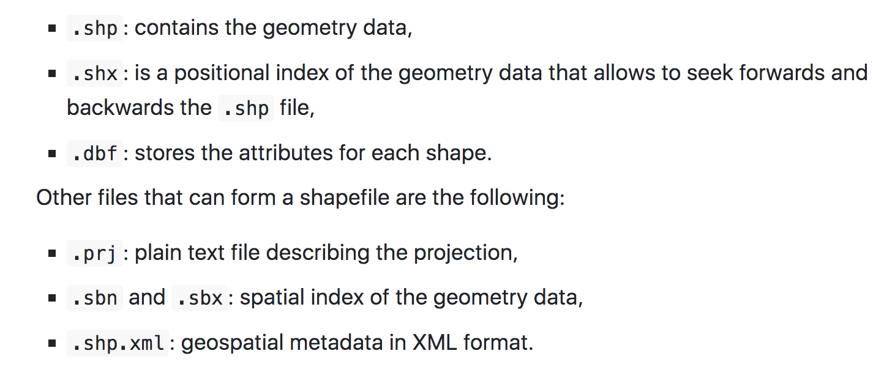

# Spatial data and R packages for mapping

**Learning objectives:**

- Spatial data types
- CRS
- making a map with R

## Spatial data and R packages for mapping


Type of Spatial data:

- areal
- geostatistical
- point patterns

```{r echo=FALSE, message=FALSE, warning=FALSE, paged.print=FALSE}
library(tidyverse)
```

Packages used:

- ggplot2
- leaflet
- mapview
- tmap

### Types of spatial data


Define the space:

$$\left\{Z(s):s\in D \subset \mathbf{R^d} \right\}$$

$$Z=\text{observed values}$$
$$s=\text{location}$$
$$D=\text{domain (aereal, geostatistical, point patterns)}$$

$$d=\text{dimension}$$


#### Areal data

The domain $D$ is **fixed** (of regular or irregular shape) and made of finite number of areal units with well-defined boundaries:

- zip code
- census tract
- pixels

```{r echo=TRUE, message=FALSE, warning=FALSE, paged.print=FALSE}
require(sf)
require(ggplot2)
require(viridis)

nc <- st_read(system.file("shape/nc.shp", package = "sf"),
  quiet = TRUE
)


ggplot(data = nc, aes(fill = SID74)) + 
  geom_sf() +
  scale_fill_viridis() + 
  labs(title="Number of sudden infant deaths",
       subtitle="counties of North Carolina, USA, in 1974") +
  theme_bw()
```


#### Geostatistical data

The domain $D$ is a **continuous fixed**:

- air pollution
- rainfall values

Data represent the average rainfall measurements for the period May-June (dry season) over different years collected at 143 recording stations throughout Paraná state, Brazil.

```{r eval=TRUE, message=FALSE, warning=FALSE, paged.print=FALSE}
require(geoR)

data.frame(cbind(parana$coords, Rainfall = parana$data))


ggplot(data.frame(cbind(parana$coords, Rainfall = parana$data)))+
  geom_point(aes(east, north, color = Rainfall), size = 2) +
  coord_fixed(ratio = 1) +
  scale_color_gradient(low = "blue", high = "orange") +
  geom_path(data = data.frame(parana$border), aes(east, north)) +
  labs(title="Average rainfall measurements",
       subtitle="May-June Paraná state, Brazil")+
  theme_bw()
```


#### Point patterns

The domain $D$ in point patterns is **random**.


```{r}
library(cholera)
rng <- cholera::mapRange()


plot(fatalities[, c("x", "y")],
  pch = 15, col = "black",
  cex = 0.5, xlim = rng$x, ylim = rng$y, 
  asp = 1,main="The locations of deaths\nof the 1854 London cholera outbreak",
  frame.plot = FALSE, 
  axes = FALSE, xlab = "", ylab = ""
)
addRoads()
?cholera::addRoads()
```


## Coordinate reference systems

Spatial data representation is represented with projected **coordinate reference systems (CRS)**. 

What the CRS do?

- set the origin and the unit of measurement of the coordinates
- allows transformation of all data to a common CRS

Locations can be:

- **unprojected** (geographic reference systems) use **longitude and latitude**
```{r}
world<-map_data("world")
ggplot(world,aes(long,lat,group=group))+
  geom_polygon(fill="#e1a95f",color="grey30",size=0.3)+
  coord_map(projection = "ortho",orientation = c(10,-80,0))+
  theme_void()+
  theme(panel.grid = element_line(color="grey80"))
```

- **projected** use **easting and northing Cartesian coordinates** 

```{r}
world<-map_data("world")
ggplot(world,aes(long,lat,group=group))+
  geom_polygon(fill="#e1a95f",color="grey30",size=0.3)+
  coord_sf()+
  theme_void()+
  theme(panel.grid = element_line(color="grey80"))
```

### Geographic coordinate systems

Latitude and longitude are angles in decimal degrees (DD) or in degrees, minutes, and seconds (DMS).

### Projected coordinate systems


> "A map projection is a transformation of the Earth’s three-dimensional surface as a flat two-dimensional plane."

-  Universal Transverse Mercator (UTM): divides the Earth into 60 zones of 6 degrees of longitude in width. Each of the zones uses a transverse Mercator projection that maps a region of large north-south extent.


### Setting Coordinate Reference Systems in R


The Earth’s shape can be approximated by an **oblate ellipsoid model**,bulges at the equator and is flattened at the poles.

The most common reference ellipsoids in use is **World Geodetic System (WGS84)** which is used for example by the Global Positioning System (GPS).

Elements in the CRS **proj4 attributes**:

- +init = epsg: 4326 (the Earth's center of mass)
- +proj = longlat/utm
- +zone = there are 60 zones
- +ellps = WGS84 (most common)
- +datum = WGS84 (define the position of the ellipsoid relative to the center of the Earth, it provides the origin point and defines the direction of the coordinate axes)
- units = m (if meters)

To check all the available CRS in R:
```{r}
# View(rgdal::make_EPSG())
```


[EPSG](https://en.wikipedia.org/wiki/EPSG_Geodetic_Parameter_Dataset) **Geodetic Parameter Dataset** (also EPSG registry) is a public registry of geodetic datums, spatial reference systems, Earth ellipsoids, coordinate transformations and related units of measurement. Originally created by **European Petroleum Survey Group (EPSG)**.


```{r message=FALSE, warning=FALSE, paged.print=FALSE}
library(rgdal)

# setting the projections
# proj4string(d) <- CRS(projection)

# create data with coordinates given by longitude and latitude
d <- data.frame(long = rnorm(100, 0, 1), 
                lat = rnorm(100, 0, 1))

coordinates(d) <- c("long", "lat")

# assign CRS WGS84 longitude/latitude
proj4string(d) <- CRS("+proj=longlat +ellps=WGS84 +datum=WGS84 +no_defs")

# reproject data from longitude/latitude to UTM zone 35 south
d_new <- spTransform(d, CRS("+proj=utm +zone=35 +ellps=WGS84 +datum=WGS84 +units=m +no_defs +south"))
st_crs(4326)

# add columns UTMx and UTMy
d_new$UTMx <- coordinates(d_new)[, 1]
d_new$UTMy <- coordinates(d_new)[, 2]
```

## Shapefiles

Consists of a collection of related files that have different extensions and a common name and are stored in the same directory. 

A shapefile has three mandatory files with extensions .shp, .shx, and .dbf

```{r}

```


```{r}
# name of the shapefile of North Carolina of the sf package
nameshp <- system.file("shape/nc.shp", package = "sf")
# read shapefile with readOGR()
library(rgdal)
map <- readOGR(nameshp, verbose = FALSE)

class(map)

map@bbox
map@proj4string

head(map@data)
```


```{r}
plot(map)
```

```{r}
# read shapefile with st_read()
library(sf)
map <- st_read(nameshp, quiet = TRUE)

class(map)
```

```{r}
head(map)
```

```{r}
plot(map)
```

## Making maps with R
### ggplot2
```{r}
require(ggplot2)

map <- st_as_sf(map)
ggplot(map) + geom_sf(aes(fill = SID74)) + theme_bw()
```


```{r}
require(viridis)
map <- st_as_sf(map)
ggplot(map) + geom_sf(aes(fill = SID74)) +
  scale_fill_viridis() + theme_bw()
```


```{r eval=TRUE}
# png("plot.png")
ggplot(map) + 
  geom_sf(aes(fill = SID74)) +
  scale_fill_viridis() + 
  theme_bw()
# dev.off()
```

### leaflet
```{r}
st_crs(map)
```


```{r}
library(leaflet)

pal <- colorNumeric("YlOrRd", domain = map$SID74)

leaflet(map) %>%
  addTiles() %>%
  addPolygons(
    color = "white", fillColor = ~ pal(SID74),
    fillOpacity = 1
  ) %>%
  addLegend(pal = pal, values = ~SID74, opacity = 1)
```

### mapview
```{r}
library(mapview)
mapview(map, zcol = "SID74")
```

```{r}
library(RColorBrewer)
pal <- colorRampPalette(brewer.pal(9, "YlOrRd"))
mapview(map,
  zcol = "SID74",
  map.types = "CartoDB.DarkMatter",
  col.regions = pal
)
```


```{r}
require(leafsync)
m74 <- mapview(map, zcol = "SID74")
m79 <- mapview(map, zcol = "SID79")
m <- leafsync::sync(m74, m79) #(not from mapview)
m
```

### tmap
[Vignette](https://cran.r-project.org/web/packages/tmap/vignettes/tmap-getstarted.html)
```{r}
library(tmap)
tmap_mode("view")
tm_shape(map) + tm_polygons("SID74")
```


## Meeting Videos

### Cohort 1

`r knitr::include_url("https://www.youtube.com/embed/URL")`

<details>
<summary> Meeting chat log </summary>

```
LOG
```
</details>
