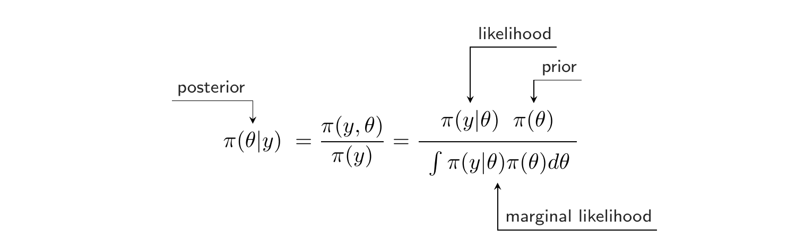
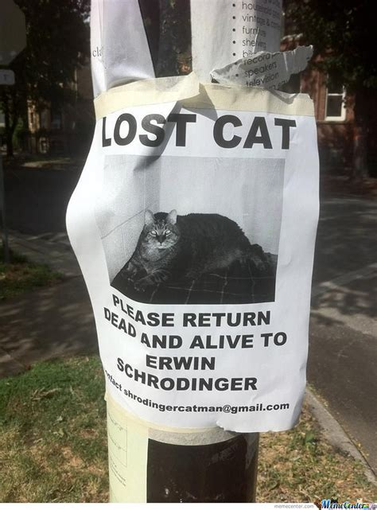
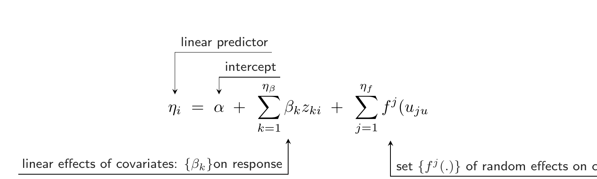

# Bayesian inference and INLA

**Learning objectives:**

- Introduction to Bayesian Inference and INLA

- Introduction to Integrate nested Laplace approximation

## Bayesian inference

Why Bayesian? 

- Bayesian hierarchical models are often use for spatial / spatio-temporal data.

Quick note: we will define "hierarchical" later but now keep it mind that he has more than one layer  

> Flexibility in how estimates can borrow strength across space and time

We need to specify:

* a probability distribution called a likelihood :

```{tikz figure1, eval=FALSE ,echo = FALSE, fig.cap = "Likelihood", fig.ext = 'vsg', engine.opts = list(template = "standalone_1x5in.tex")}
\begin{equation*}
    \eqnmark{proba}{\pi}(\eqnmark{data}{y} | \eqnmark{param}{\theta}) 
\end{equation*}
\annotate[yshift=1em]{above,right}{proba}{Probability}
\annotate[yshift=-1em]{below,left}{data}{data: $(y_1, ..., y_n)$ }
\annotate[yshift=-1em]{below,right}{param}{Parameters (unknown)}
```


* a prior distribution:

```{tikz figure2, eval=FALSE, echo = FALSE, fig.cap = "Prior distribution", fig.ext = 'vsg', engine.opts = list(template = "standalone_1x5in.tex")}
\begin{equation*}
    \pi(\eqnmark{param}{\theta} | \eqnmark{hyperparam}{\eta}) 
\end{equation*}
\annotate[yshift=1em]{above,left}{param}{Parameters}
\annotate[yshift=-1em]{below,right}{hyperparam}{Hyperparameters}
```


Then you have 2 approach :

- Fully Bayesian: specify hyperprior for $\eta$

- Empirical Bayes: using $\eta$ estimates as if we know it/them

If we know $\eta$ we can do our inference on $\theta$ using Bayes's Theorem:

```{tikz figure3, eval=FALSE, echo = FALSE, fig.cap = "Bayes's Theorem", fig.ext = 'vsg', engine.opts = list(template = "standalone_1x5in.tex")}
\begin{equation*}
	\eqnmark{post}{\pi(\theta | y)} = \frac{\pi(y,\theta)}{\pi(y)}  = \frac{\eqnmark{lik}{\pi(y|\theta)} \eqnmark{prior}{\pi(\theta)}} {\eqnmark{marglik}{\int\pi(y|\theta)\pi(\theta)d\theta}}
\end{equation*}
\annotate[yshift=2.5em]{above,right}{lik}{likelihood}
\annotate[yshift=1em]{above,right}{prior}{prior}
\annotate[yshift=1em]{above,left}{post}{posterior}
\annotate[yshift=-1em]{below,right}{marglik}{marginal likelihood}
```



Quick reminder: $P(A\cap B) = P(A|B)P(B)$ 

The denominator $\pi(y) = \int\pi(y|\theta)\pi(\theta)d\theta$ is the  marginal likelihood of the data $y$. To get a probability we need to make $\pi(\theta|y)$ bound between 0 and 1 this is the goal of the marginal likelihood also know as *normalizing constants*. 


### A small analogy with R: garden of forking data 

Source: chapter2 of [Rethinking statistics](https://xcelab.net/rm/statistical-rethinking/) from Richard McElreath   
Other good read: [chapter 2 of Bayes Rules!](https://www.bayesrulesbook.com/chapter-2.html) from Alicia A.Johnson, Miles Q. Ott and Mine Dogucu

A bag with 4 marbles, they can be blue (U) or white (W). We do not know the exact composition but we know what are our options ("parameters") and we have data: we draw (with replacement) U / W / U. 

```{r}
Parameter <-  c("WWWW", "UWWW", "UUWW", "UUUW", "UUUU")
Paths_U_W_U <- c("0 x 4 x 0", "1 x 3 x 1", "2 x 2 x 2 ", "3 x 1 x 3", "4 x 0 x 4")
bille.dat <- data.frame(Parameter, Paths_U_W_U)
bille.dat$data <- c(0, 3, 8, 9, 0)
knitr::kable(bille.dat)
```

We are drawing an other marble: U

```{r}
Parameter <-  c("WWWW", "UWWW", "UUWW", "UUUW", "UUUU")
Paths_U <- c(0, 1, 2, 3, 4)
bille2.dat <- data.frame(Parameter, Paths_U)
bille2.dat$Prior <- c(0, 3, 8, 9, 0)
bille2.dat$New_posterior <- Paths_U * bille2.dat$Prior
knitr::kable(bille2.dat)
```

We can go a step further with $p$ (the parameter we want to know) as our proportion of blue marble.


```{r}
Parameter <- c("WWWW", "UWWW", "UUWW", "UUUW", "UUUU")
p <- c(0, 0.25, 0.5, 0.75, 1)
tabl_def <- data.frame(Parameter, p)
tabl_def$Paths <- c( 0 , 3 , 8 , 9 , 0 )
tabl_def$Marginal_likelihood <- tabl_def$Paths/sum(tabl_def$Paths)
knitr::kable(tabl_def)
```


Here our distribution was discrete (marbles) but with continuous distribution the idea is the same (this is just more difficult to do the math!).

Important point: marginal likelihood do not "depends" of parameters we will have the same shape of our distribution without it (it is proportional) :

$$\pi(\theta|y) \propto \pi(y|\theta)\pi(\theta)  $$

In this quick example we just have one parameter (proportion of blue = 1 - proportion of white) so we can "just" count but in a lot of times calculating the posterior is way harder. 

MCMC (Markov chain Monte Carlo) methods are used to create sample of $\theta$ then we can use it sample to get the posterior distribution of our parameters.

Implementations of MCMC:

* WinBUGS

* JAGS

* Stan

You need to do use diagnostics on the sample create with MCMC (traceplot, effective sample size ratio, etc ..)

They are great but can be heavy on computing!

When we are with a latent Gaussian models a computational less-intensive alternative: INLA

INLA website: http://www.r-inla.org

## Integrated nested Laplace approximation

I still do not get it!



It can be used for:  

1. It is also used for generalized linear mixed models: check [this](https://akawiecki.github.io/statistical_rethinking_inla/) (from Anna B. Kawieck)

2. spatio-spatio-temporal models 

Model that follow this form: 

$$y_i|x, \theta \sim \pi(y_i|x_i, \theta), i = 1, ..., n,$$

$$x|\theta \sim N(\mu_\theta, Q(\theta)^{-1})$$

$$\theta \sim \pi(\theta)$$

$y$ : observed data 

$x$ : Gaussian fields / latent Gaussian field / latent effect also known as Gaussian Markov random fields (GMRF)

$\theta$ : hyperparameters (here you have parameters + parameters for parameters)

Caution: $x$ and $y$ can be high-dimensional but not ($theta$)

$\mu_{\theta}$ mean of our Gaussian field

$Q(\theta)^{-1}$ is the precision matrix = $C^{-1}$ (inverse of covariance matrix) and we want the variance inside the $N()$

Why are we using precision instead of variance (source [wiki](https://en.wikipedia.org/wiki/Precision_%28statistics%29)): 

  * easier time on computation  
  
  * in multivariable normal distribution or joint normal distribution it make stuff easier 


We are assuming that the mean $\mu_i$ of our observations $Y_i$ can be linked to a linear predictor (ex: $\mu_i = g^{-1}(\eta_i)$ ): 

```{tikz figure4, eval=FALSE, echo = FALSE,  fig.ext = 'vsg', engine.opts = list(template = "standalone_1x5in.tex")}
\begin{equation*}
\eqnmark{linear}{\eta_i} = \eqnmark{inter}{\alpha} + \eqnmark{eff_cov}{\displaystyle\sum_{k=1}^{\eta_\beta}\beta_k z_{ki}} + \eqnmark{random_eff}{\displaystyle\sum_{j=1}^{\eta_f}f^{j} (u_{ju}}
\end{equation*}
\annotate[yshift=2.5em]{above,right}{linear}{linear predictor}
\annotate[yshift=1em]{above,right}{inter}{intercept}
\annotate[yshift=-1em]{below,left}{eff_cov}{linear effects of covariates: $\{\beta_k\}$on response}
\annotate[yshift=-1em]{below,right}{random_eff}{set $\{f^{j}(.)\}$ of random effects on covariates: $u_{ji}$ }
```


$$ (\alpha\{\beta_k\}, \{f^{(j)}\})|\theta \sim N(\mu(\theta), Q(\theta)^{-1}) $$

Focus on individual posterior **marginals** of the model parameters (see below!) and some **approximations** instead of the joint posterior distribution of the model parameters (what MCMC do).

Posterior marginals of the component of the latent Gaussian variables:

$$\pi(x_i|y), i = 1, .., n$$
Posterior marginals for the hyperparameters of the Gaussian latent model

$$\pi(\theta_j|y), j = 1, .., dim(\theta) $$

Posterior marginals of each element $x_i$ of the latent fiield $x$:

$$\pi(x_i|y) = \int \pi(x_i|\theta, y)\pi(\theta|y)d\theta $$

Posterior marginals for the hyperparameters (general):

$$ \pi(\theta_j|y) = \int \pi(\theta|y)d\theta_j $$

Then some approximations that lead us to get: 

$$\tilde{\pi}(x_i|y) = \int \tilde{\pi}(x_i|\theta_k, y)\tilde{\pi}(\theta_k|y) \times \Delta_k  $$

$$ \tilde{\pi}(\theta_j|y) = \sum\pi(\theta^{*}_l|y)  \times \Delta^*_l$$

Approximations: 

- Gaussian approximations 

- Laplace approximations (more costly)

- simplified Laplace approximations (compromise), used by default in R-INLA

### Resources:

[Blog post](https://www.precision-analytics.ca/articles/a-gentle-inla-tutorial/) from Kathryn Morrison 

[Book](https://becarioprecario.bitbucket.io/inla-gitbook/ch-INLA.html) from Virgilio Gómez-Rubio

## Meeting Videos

### Cohort 1

`r knitr::include_url("https://www.youtube.com/embed/URL")`

<details>
<summary> Meeting chat log </summary>

```
LOG
```
</details>
