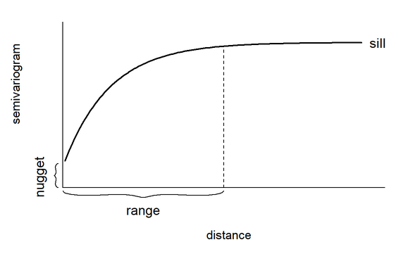
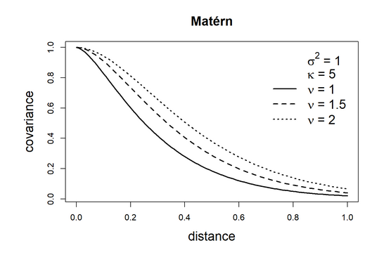

# Geostatistical data

**Learning objectives:**

- Learn about geostatitics:

  * striclky, weakly, intrinsic stationarity  
  * Isotropy/anysotropy  
  * Emperical variogram  
  * Exponential and Matèrn covariance functions  

- **S**tochastic **P**artial **D**ifferential **E**quation approach (SPDE)
  
- Practice modelling geostatistics data 

  * Model (Binomial / Gaussian)
  * Mesh Delaunay triangulation 
  * Displaying result!

```{r load_lib}
library(INLA)
library(geoR)
library(ggplot2)
```


## Geostatistical data 

Remember: Areal data: discrete data 

- Continuous phenomenon (density of mosquito) but recorded at specific locations (trap for mosquito)

$${Z(s) : s \in  D \subset \mathbb{R}^2}$$

$Z(s_1), ..., Z(s_n)$ observation of Z (spatial variable) at $s_1, ..., s_n$ (locations)


### Gaussian Random Fields (GRF)

> A Gaussian random field (GRF) is a collection of random variables where the observations occur in a continuous domain, and where every finite collection [ex: latitude, longitude] of random variables has a **multivariate normal distribution**.

Random process = stochastic process

.. by definition it can't be constant 

### Stationarity 

- *strickly/strong stationary*: a shift in location will not result in any change in the joint distribution of the random variables  (ex: white noise)

- *weak stationary* (second order): mean are constant on the domain $D$  and covariances depend only on the difference between locations ($h$) :

$$Cov(Z(s), Z(s+h)) = C(h) $$

C is a covariance function (see later with Matèrn)

- *Intrinsic stationary:*  the variance between two locations relies only on the distance ($h$) (and not their location).

$Var(Z(s+h) - Z(s))$ it is called a **variogram**

Remember: $Var(X) = E[(X -E(X))^2]$

$$ Var(Z(s + h) - Z(s)) =  E\{Z(s+h) - Z(s) - E(Z(s+h) + Z(s))\}^2$$

We reorganize it:

$$2 \gamma  = E\{(Z(s+h) - E(Z(s+h))) - (Z(s) - E(Z(s))))\}^2$$

$$2\gamma = E\{(Z(s+h) -E(Z(s+h)))^2\} + E\{(Z(s) - E(Z(s)))^2\} \\
     - 2E\{(Z(s+h) - E\{(Z(s+h))\}) * (Z(s) - E\{(Z(s)\})\}$$


$$2\gamma = Var(Z(s+h)) + Var(Z(s)) - 2Cov(Z(s+h), Z(s)) $$

Remember that $Var(Z(s+h)) = Var(Z(s))$:

$$ 2 \gamma = C(0) + C(0) - 2C(h)$$

Then a *semivariogram* is composed of $C(0)$ (or *nugget*) and $C(h)$ (or spatial covariance function)

$$ \gamma = C(0) - C(h) $$

We can also obtain the *empirical semivariogram* this way:

$$\hat{\gamma}(h) = \frac{1}{2|N(h)|}\sum_{N(h)}(Z(s_i) - Z(s_j))² $$
#### Isotropy/Anisotropy

The direction of $h$ does not matter only it's length = **isotropy**



TODO maybe: draw it with R

let's pick a distance $d$, remember cov = var * cor

$$C(d) = \sigma² \rho(d), \quad d > 0  $$

$\rho(d)$ is a correlation function when $\rho(d) = 0$ it is called *range*, it is the minimun distance were random observation are said to be "independant". This is very hard to get so we use *effective range* were we have a very low amount of correlation (usually 0.05). 

### Usefull covariance functions

They should not allow negative values for variance (yup variation can only be positive). 

#### Exponential model

$$Cov(Z(s_i), Z(s_j)) = \sigma^2 exp(-k||s_i -s_j||) $$


```{r expo_model}
h <- seq(from = 0, to = 1, by = .05)
sigma = 1

expo_model <- function(sigma, k, h) {
  sigma^2 * exp(-k * h)
}

# k is the decay
k_10 <- expo_model(sigma, k = 10, h)
k_5 <- expo_model(sigma, k = 5, h)
k_1 <- expo_model(sigma, k = 1, h)

plot(h, k_10, type = "l", ylab = "Cov" )
lines(h, k_5, lty = 2)
lines(h, k_1, lty = 3)

```


#### Matèrn model

$$Cov(Z(s_i), Z(s_j)) = \frac{\sigma^2}{2^{v-1}\Gamma(v)}(k||s_i - s_j||)^vK_v(k||s_i-s_j||)$$
$K$ is the *effective range* here define when $\rho = \frac{\sqrt(8)}{k}$ 



TODO: undertand it and `INLA::inla.matern.cov()` 


## Stochastic partial differntial equation approach

I do not have understand it but: 

- A GRF with a Matern covariance matrix can be expressed as a solution to predict the variable of interest. 

- the parameters of Matèrn covariance and SPDE are coupled (INLA default is smouthness of 1/2 ie exponential cov.)

We can approximate SPDE using the Finite Element method: divide $D$ into a set of of non-intersecting triangles. 

That bring us to a mesh with $n$ nodes and $n$ basis function (each function decrease when going away of the node). That allows use to go from a continuous Gaussian field to a discrete indexed Gaussian markov random field. 


$$x(s) = \sum^n_{k = 1} \psi_k(s)x_k $$

$x_k$ are the zero mean gaussian distributed weights

$x = (x_1, ..., x_n) \sim N(0, Q^{-1}(\tau,k))$ (N is a joint distribution) give an approximation of $x(s)$

## Spatial modeling of rainfall in Paraná, Brazil

### Data

Average rainfall recorded over different year over May-June at 143 stations

```{r ploting_data}
data.frame(cbind(parana$coords, Rainfall = parana$data)) |>
ggplot()+
  geom_point(aes(east, north, color = Rainfall), size = 2) +
  coord_fixed(ratio = 1) +
  scale_color_gradient(low = "blue", high = "orange") +
  geom_path(data = data.frame(parana$border), aes(east, north)) +
  theme_bw()
```

### Model

$$ Y_i \sim N (\mu_i, \sigma^2), i = 1,2, ..., n$$

$$\mu_i = \beta_0 + Z(si) $$

Rainfall as a normal distribution with a mean that follow a zero-mean Gaussian process with a Matèrn covariance function. 

#### Mesh construction

```{r mesh1}
coo <- parana$coords # I think they are in degree
summary(dist(coo))
```
```{r mesh2}
mesh <- inla.mesh.2d(
  loc = coo, # our coords
  offset = c(50, 100), # inner border and outer border
  cutoff = 1, # avoid building small and plenty triangle if point are close
  max.edge = c(30, 60) # small triangle (30) and big one outside (60)
)

# we have a warning of a deprecated function
plot(mesh)
points(coo, col = "red")
```

```{r mesh_str}
str(mesh, max.level = 1)
```

On this one we did not use `boundary`: 

```{r mesh_boundary}
bnd <- inla.nonconvex.hull(coo)
meshb <- inla.mesh.2d(
  boundary = bnd, offset = c(50, 100),
  cutoff = 1, max.edge = c(30, 60)
)
plot(meshb)
points(coo, col = "red")
```

#### SPDE model on the mesh

$$ \alpha = v + d/2$$

d = 2 in spatial 2D case

```{r matern}
spde <- inla.spde2.matern(mesh = mesh, alpha = 2, constr = TRUE)
```

```{r index}
indexs <- inla.spde.make.index("s", spde$n.spde)
```

#### Projection matrix:

We need to build a matrix that contains n rows (n = number of locations) and m column (m = vertex of triangle).


```{r meshmatrix}
A <- inla.spde.make.A(mesh = mesh, loc = coo)
rowSums(A) |> sum()
```

#### Prediction data 

We nee to build a grid: 50 x 50 

```{r expand_grid}
bb <- bbox(parana$border) # bounding box
x <- seq(bb[1, "min"] - 1, bb[1, "max"] + 1, length.out = 50) # increase a bit the size 
y <- seq(bb[2, "min"] - 1, bb[2, "max"] + 1, length.out = 50)
coop <- as.matrix(expand.grid(x, y))
```

Then you keep point only inside the border:

```{r}
ind <- point.in.polygon(
  coop[, 1], coop[, 2],
  parana$border[, 1], parana$border[, 2]
)
coop <- coop[which(ind == 1), ]
plot(coop, asp = 1)
```
And create a projection matrix with it:

```{r}
Ap <- inla.spde.make.A(mesh = mesh, loc = coop)
dim(Ap) 
```

#### Building estimation and prediction "stack"

```{r}
# stack for estimation stk.e
stk.e <- inla.stack(
  tag = "est",
  data = list(y = parana$data),
  A = list(1, A),
  effects = list(data.frame(b0 = rep(1, nrow(coo))), s = indexs) # our models b0 and spatial effect
)

# stack for prediction stk.p
stk.p <- inla.stack(
  tag = "pred",
  data = list(y = NA), # to be filled
  A = list(1, Ap),
  effects = list(data.frame(b0 = rep(1, nrow(coop))), s = indexs)
)

# stk.full has stk.e and stk.p
stk.full <- inla.stack(stk.e, stk.p)
```

#### Formula

```{r formula}
formula <- y ~ 0 + b0 + f(s, model = spde) # 0 for no intercept
```


#### Inla() call

This is not intuitive:

```{r}
res <- inla(formula,
  data = inla.stack.data(stk.full), #it has both data and grid
  control.predictor = list(
    compute = TRUE,
    A = inla.stack.A(stk.full)
  )
)
```


#### result!

We will get the index of the rows with prediction and use it to extract the correct mean and quantiles:

```{r}
index <- inla.stack.index(stk.full, tag = "pred")$data

pred_mean <- res$summary.fitted.values[index, "mean"]
pred_ll <- res$summary.fitted.values[index, "0.025quant"]
pred_ul <- res$summary.fitted.values[index, "0.975quant"]
```

We build a tidy data frame with it: 

```{r}
dpm <- rbind(
  data.frame(
    east = coop[, 1], north = coop[, 2],
    value = pred_mean, variable = "pred_mean"
  ),
  data.frame(
    east = coop[, 1], north = coop[, 2],
    value = pred_ll, variable = "pred_ll"
  ),
  data.frame(
    east = coop[, 1], north = coop[, 2],
    value = pred_ul, variable = "pred_ul"
  )
)
dpm$variable <- as.factor(dpm$variable)
```

And map it: 

```{r}
ggplot(dpm) + geom_tile(aes(east, north, fill = value)) +
  facet_wrap(~variable, nrow = 1) +
  coord_fixed(ratio = 1) +
  scale_fill_gradient(
    name = "Rainfall",
    low = "blue", high = "orange"
  ) +
  theme_bw()
```

#### just the spatial field:

```{r}
newloc <- cbind(c(219, 678, 818), c(20, 20, 160))
Aproj <- inla.spde.make.A(mesh, loc = newloc)
Aproj %*% res$summary.random$s$mean
```

```{r}
rang <- apply(mesh$loc[, c(1, 2)], 2, range)
proj <- inla.mesh.projector(mesh,
  xlim = rang[, 1], ylim = rang[, 2],
  dims = c(300, 300)
)

mean_s <- inla.mesh.project(proj, res$summary.random$s$mean)
sd_s <- inla.mesh.project(proj, res$summary.random$s$sd)

df <- expand.grid(x = proj$x, y = proj$y)
df$mean_s <- as.vector(mean_s)
df$sd_s <- as.vector(sd_s)

library(viridis)
library(cowplot)

gmean <- ggplot(df, aes(x = x, y = y, fill = mean_s)) +
  geom_raster() +
  scale_fill_viridis(na.value = "transparent") +
  coord_fixed(ratio = 1) + theme_bw()

gsd <- ggplot(df, aes(x = x, y = y, fill = sd_s)) +
  geom_raster() +
  scale_fill_viridis(na.value = "transparent") +
  coord_fixed(ratio = 1) + theme_bw()

plot_grid(gmean, gsd)
```


## Meeting Videos

### Cohort 1

`r knitr::include_url("https://www.youtube.com/embed/URL")`

<details>
<summary> Meeting chat log </summary>

```
LOG
```
</details>
