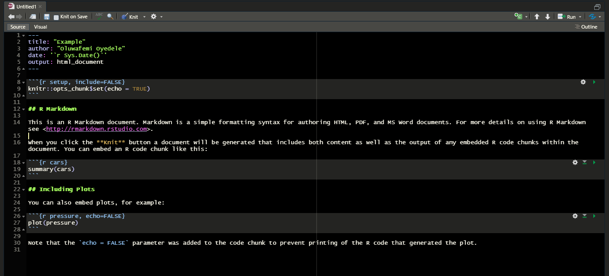
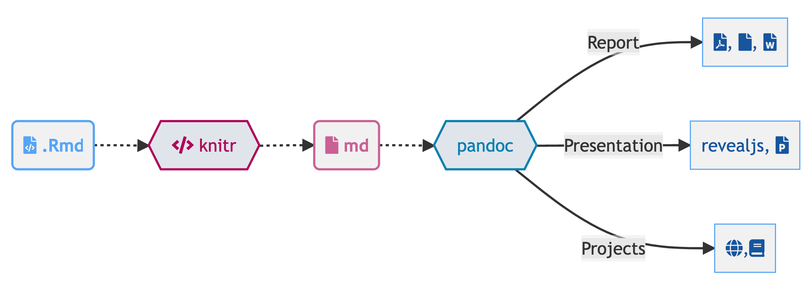

# Introduction to R Markdown

**Learning objectives:**

- Introduction to R Markdown.

- Explain the Structure of the R Markdown documents

- Format text using R Markdown.

- R Code Chunks

- How to include Figures in R Markdown

- How to include Tables in R Markdown

- **Examples on how to compose a note in R Markdown**


## Introduction

R Markdown provides a unified authoring framework for data science, combining your code, its results, and your data in one computational environment.
R Markdown documents are fully reproducible and support dozens
of output formats, like PDFs, Word files, slideshows, html and more.


**R Markdown files are designed to be used in three ways:**

- For communicating to decision makers, who want to focus on
the conclusions, not the code behind the analysis.

- For collaborating with other data scientists (including future
you!), who are interested in both your conclusions, and how
you reached them (i.e., the code).

- As an environment in which to do data science, as a modern day
lab notebook where you can capture not only what you did, but
also what you were thinking.


## Steps in creating an Rmarkdown documents

To get started with your own .Rmd file, select File → New File → R
Markdown… in the menu bar. RStudio will launch a wizard that you
can use to pre-populate your file with useful content that reminds
you how the key features of R Markdown work.

## Structure of R Markdown

- YAML header specifying several document options such as the output format, author and date e.t.c.

- text written with Markdown syntax,

- R code chunks with the code that needs to be executed.

The basic structure of a R markdown is shown below:




**Other YAML options include the following:**

- fontsize to specify the font size e.t.c.

- toc: true to include a table of contents at the start of the document

For example, the YAML below specifies an HTML document with font size 12pt, and includes a table of contents where 2 is the lowest level of headings. The date of the report is set to the current date by writing the inline R expression `r Sys.Date()`.

```{r,eval=FALSE}
---
title: "An R Markdown document"
author: "Paula Moraga"
date: "`r Sys.Date()`"
fontsize: 12pt
output:
  html_document:
    toc: true
    toc_depth: 2
---
```


To generate a document from the .Rmd file, we can use the **Knit** button in the RStudio IDE or use the **render()** function of the rmarkdown package. The **render()** function has an argument called **output_format** where we can select the format we want for the final document. 


## Text Formating in R Markdown

The text in an R Markdown file is written with Markdown syntax. Markdown is a lightweight markup language that creates styled text using a lightweight plain text syntax. For example, we can use asterisks to generate italic text and double asterisks to generate bold text.

```{r,eval=FALSE}
*italic text*
**bold text**
```

We can mark text as inline code by writing it between a pair of backticks.

```{r,eval=FALSE}

`x+y`

```

To start a new pararaph, we can end a line with two or more spaces. We can also write section headers using pound signs (#, ## and ### for first, second and third level headers, respectively).

```{r,eval=FALSE}
# First-level header
## Second-level header
### Third-level header
```
- Lists with unordered items can be written with -, *, or +, and lists with ordered list items can be written with numbers. Lists can be nested by indenting the sublists.

```{r,eval=FALSE}
- unordered item
- unordered item
    1. first item
    2. second item
    3. third item
```
We can also write math formulas using LaTex syntax.
```{r,eval=FALSE}
$$\int_0^\infty e^{-x^2} dx=\frac{\sqrt{\pi}}{2}$$
```
$$\int_0^\infty e^{-x^2} dx=\frac{\sqrt{\pi}}{2}$$


Hyperlinks can be added using the syntax [text](link). For example, a hyperlink to the R Markdown website can be created as follows:

```{r,eval=FALSE}
[R Markdown](https://rmarkdown.rstudio.com/)

```
[R Markdown](https://rmarkdown.rstudio.com/)

## R Code Chunks

The R code that we wish to execute needs to be specified inside an R code chunk. An R chunk starts with three backticks. We can also write inline R code by writing it between a single back ticks. We can specify the behavior of a chunk by adding options in the first line between the braces and separated by commas. For example, if we use

- **echo=FALSE** the code will not be shown in the document, but it will run and the output will be displayed in the document,

- **eval=FALSE** the code will not run, but it will be shown in the document,

- **include=FALSE** the code will run, but neither the code nor the output will be included in the document,

- **results='hide'** the output will not be shown, but the code will run and will be displayed in the document.

Sometimes, the R code produces messages we do not want to include in the final document. To supress them, we can use

- **error=FALSE** to supress errors,

- **warning=FALSE** to supress warnings,

- **message=FALSE** to supress messages.

In addition, if we wish to use certain options frequently, we can set these options globally in the first code chunk. Then, if we want particular chunks to behave differently, we can specify different options for them. For example, we can supress the R code and the messages in all chunks of the document as follows:


Below, is an example of R code chunk that loads the gapminder package and attaches the gapminder data that contains data of life expectancy, gross domestic product (GDP) per capita (US$, inflation-adjusted), and population by country from 1952 to 2007. Then it shows its first elements with **head(gapminder)** and a summary with **summary(gapminder)**. The chunk includes an option to **supress warnings**.

```{r, warning=FALSE}
library(gapminder)
data(gapminder)
head(gapminder)
summary(gapminder)
```


## Figures

Figures can be created by writing the R code that generates them inside an R code chunk. In the R chunk we can write the option **fig.cap** to write a caption, and **fig.align** to specify the alignment of the figure ('left', 'center' or 'right'). We can also use **out.width** and **out.height** to specify the size of the output. For example, out.width = **'80%'** means the output occupies 80% of the page width.

The following chunk creates a scatterplot with life expectancy at birth versus GDP per capita in 2007 obtained from the gapminder data. The chunk uses **fig.cap** to specify a caption for the figure.


```{r, fig.cap='Life expectancy versus GDP per capita in 2007.'}
library(ggplot2)
ggplot(
  gapminder[which(gapminder$year == 2007), ],
  aes(x = gdpPercap, y = lifeExp)
) +
geom_point() +
  xlab("GDP per capita (US$)") +
  ylab("Life expectancy (years)")
```  


Images that are already saved can also be easily included with Markdown syntax. For example, if the image is saved in **path path/img.png**, it can be included in the document using

```{r,eval=FALSE}

```


We can also include the image with the include_graphics() function of the knitr package. This allows to specify chunk options. For example, we can include a centered figure that occupies 25% of the document and has caption.

```{r, eval=FALSE,out.width='25%', fig.align='center', fig.cap='Figure 1'}
knitr::include_graphics("path/img.png")
```

## Tables

Tables can be included with the kable() function of the knitr package. kable() has an argument called caption to add a caption to the table produced. The code below shows the code to create a table with the first rows of the gapminder data.

```{r}
knitr::kable(head(gapminder),
  caption = "First rows of the 'gapminder' data."
)
```


Other possible Markdown syntax specifications and R chunks options can be explored in the R Markdown reference [**R Markdown Reference Guide**](https://www.rstudio.com/wp-content/uploads/2015/03/rmarkdown-reference.pdf).

[**R Markdown Cheat Sheet**](https://raw.githubusercontent.com/rstudio/cheatsheets/main/rmarkdown.pdf).


## Examples on how to compose a note in R Markdown


## Meeting Videos

### Cohort 1

`r knitr::include_url("https://www.youtube.com/embed/iHlF2GOq_VI")`

<details><summary> Meeting chat log </summary>
```
00:30:06	defuneste:	`r 1+2`
00:30:11	defuneste:	i think
00:57:36	defuneste:	rmarkdown::render("Demo.Rmd")
```
</details>
