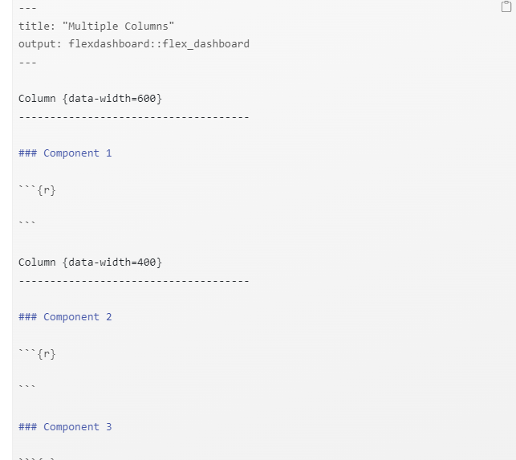
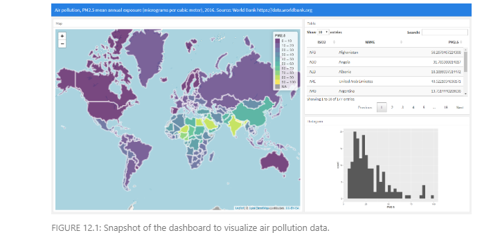

# Building a dashboard to visualize spatial data with flexdashboard

**Learning objectives:**

- We are going to learn how to use the flexdashboard to visualize the fine particulate air pollution levels (PM 2.5) in each of the world countries in 2016.

## The R package flexdashboard

- To create a dashboard with flexdashboard we need to write an R Markdown file with the extension .Rmd

## R Markdown

- R Markdown allows easy work reproducibility by including R code that generates results and narrative text explaining the work. When the R Markdown file is compiled, the R code is executed and the results are appended to a report that can take a variety of formats including HTML and PDF documents.

- An R Markdown file has three basic components, namely, YAML header, text, and R code. At the top of the R Markdown file we need to write the YAML header between a pair of three dashes ---.

## Layout

- Dashboards are divided into columns and rows. We can create layouts with multiple columns by using -------------- for each column. Dashboard components are included by using ###. Components include R chunks that contain the code needed to generate the visualizations written between ```{r} and ```. For example, the following code creates a layout with two columns with one and two components, respectively. The width of the columns is specified with the {data-width} attribute.





- Layouts can also be specified row-wise rather than column-wise by adding in the YAML the option orientation: rows. Additional layout examples including tabs, multiple pages and sidebars are shown in the [**R Markdown website.**](https://rmarkdown.rstudio.com/flexdashboard/layouts.html)

##  Dashboard components

- Interactive JavaScript data visualizations based on HTML widgets. Examples of HTML widgets include visualizations created with the packages leaflet, DT and dygraphs. Other HTML widgets can be seen in the website [](https://www.htmlwidgets.org/)

- Charts created with standard R graphics.

- Simple tables created with knitr::kable() or interactive tables created with the DT package.

- Value boxes created with the valueBox() function that display single values with a title and an icon.

- Gauges that display values on a meter within a specified range.

- Text, images, and equations.

- Navigation bar with links to social services, source code, or other links related to the dashboard.

## A dashboard to visualize global air pollution

- Here we show how to build a dashboard to show fine particulate air pollution levels (PM
2.5) in each of the world countries in 2016.

- First, we explain how to obtain the data and the world map. 

- Then we show how to create the visualizations of the dashboard. 

- Finally, we create the dashboard by defining the layout and adding the visualizations.




## Data

```{r}
library(rnaturalearth)
library(sp)
```

```{r}
map <- ne_countries()
names(map)[names(map) == "iso_a3"] <- "ISO3"
names(map)[names(map) == "name"] <- "NAME"

```

```{r}
plot(map)
```

- We obtain PM 2.5 concentration levels using the wbstats package. This package permits to retrieve global indicators published by the World Bank.[](https://data.worldbank.org/indicator) 

- If we are interested in obtaining air pollution indicators, we can use the **wbsearch()** function setting pattern = "pollution". This function searches all the indicators that match the specified pattern and returns a data frame with their IDs and names. We assign the search result to the object indicators that can be inspected by typing indicators.

```{r}
library(wbstats)
indicators <- wbsearch(pattern = "pollution")
```

- We decide to plot the indicator PM2.5 air pollution, mean annual exposure (micrograms per cubic meter) which has code EN.ATM.PM25.MC.M3 in 2016. To download these data, we use the wb() function providing the indicator code and the start and end dates.


```{r}
d <- wb(
  indicator = "EN.ATM.PM25.MC.M3",
  startdate = 2016, enddate = 2016
)
head(d)
```

-  to calculate the positions of the ISO3 code in the map (map$ISO3) in the data (d$iso3c), and assign d$value to map$PM2.5 in that order.

```{r}
map$PM2.5 <- d[match(map$ISO3, d$iso3c), "value"]
```

- We can see the first rows of map by typing head(map).


##  Table using DT

- Here we create the visualizations that will be included in the dashboard. First, we create an interactive table that shows the data by using the DT package (Figure 12.3). We use the **datatable()** function to show a data frame with variables ISO3, NAME, and PM2.5. We set rownames = FALSE to hide row names, and options = list(pageLength = 10) to set the page length equal to 10 rows. The table created enables filtering and sorting of the variables shown.

```{r}
library(DT)

DT::datatable(map@data[, c("ISO3", "NAME", "PM2.5")],rownames = FALSE, options = list(pageLength = 10)
)
```

## Map using leaflet

Next, we create an interactive map with the PM2.5 values of each country by using the leaflet package (Figure 12.4). To color the countries according to their PM2.5 values, we first create a color palette. We call this palette pal and create it by using the colorNumeric() function with argument palette equal to viridis, domain equal to the PM2.5 values, and cut points equal to the sequence from 0 to the maximum PM2.5 values in increments of 10. To create the map, we use the leaflet() function passing the map object. We write addTiles() to add a background map, and add setView() to center and zoom the map. Then we use addPolygons() to plot the areas of the map. We color the areas with the colors given by the PM2.5 values and the palette pal.

```{r}
library(leaflet)

pal <- colorBin(
  palette = "viridis", domain = map$PM2.5,
  bins = seq(0, max(map$PM2.5, na.rm = TRUE) + 10, by = 10)
)


map$labels <- paste0(
  "<strong> Country: </strong> ",
  map$NAME, "<br/> ",
  "<strong> PM2.5: </strong> ",
  map$PM2.5, "<br/> "
) %>%
  lapply(htmltools::HTML)

leaflet(map) %>%
  addTiles() %>%
  setView(lng = 0, lat = 30, zoom = 2) %>%
  addPolygons(
    fillColor = ~ pal(PM2.5),
    color = "white",
    fillOpacity = 0.7,
    label = ~labels,
    highlight = highlightOptions(
      color = "black",
      bringToFront = TRUE
    )
  ) %>%
  leaflet::addLegend(
    pal = pal, values = ~PM2.5,
    opacity = 0.7, title = "PM2.5"
  )
```

## Histogram using ggplot2
We also create a histogram with the PM2.5
values using the ggplot() function of the ggplot2 package.

```{r}
library(ggplot2)
ggplot(data = map@data, aes(x = PM2.5)) + geom_histogram()
```


## Demonstration on how to build a flexDashboard in R


## Meeting Videos

### Cohort 1

`r knitr::include_url("https://www.youtube.com/embed/URL")`

<details>
<summary> Meeting chat log </summary>

```
LOG
```
</details>
