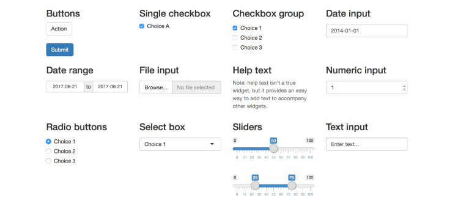
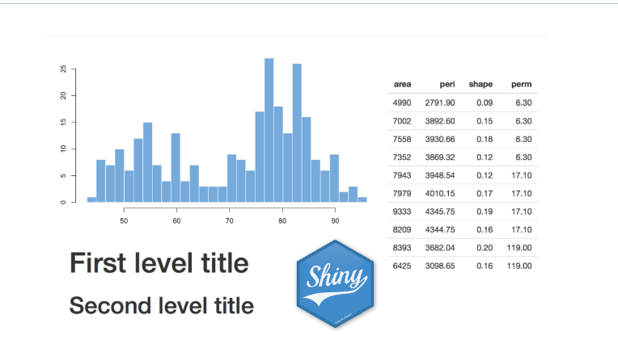
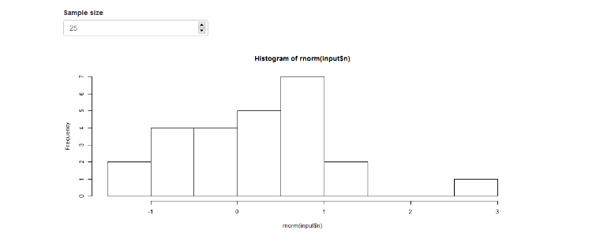
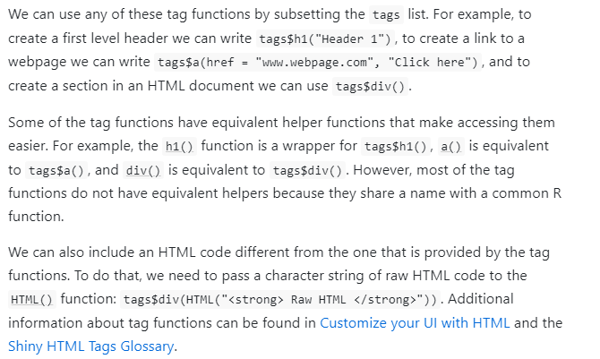
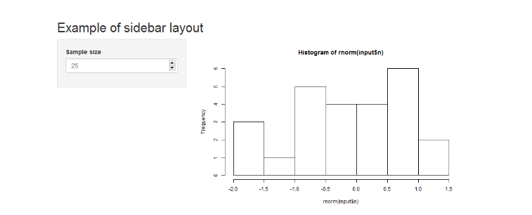

# Introduction to Shiny

**Learning objectives:**

- To explain the basic principle that is involve in building a shiny app.

- We are going to understand how to build the UI and Server part of the shiny app.

- We are also going to understand how to share our app with others.


## Introduction

- **Shiny** is a web application framework for R that enables us to build interactive web applications. 

- Shiny apps are useful to communicate information as interactive data explorations instead of static documents.

- A Shiny app is composed of a user interface ui which controls the layout and appearance of the app, and a server() function which contains the instructions to build the objects displayed in the user interface. 

- Shiny apps permit user interaction by means of a functionality called **reactivity.**

- In this way, elements in the app are updated whenever users modify some options. This permits a better exploration of the data and greatly facilitates communication with other researchers and stakeholders. 

- To create Shiny apps, there is no web development experience required, although greater flexibility and customization can be achieved by using HTML, CSS or JavaScript.

##  Structure of a Shiny app

A Shiny app can be built by creating a directory (called, for example, appdir) that contains an R file (called, for example, app.R) with three components:

- a user interface object (ui) which controls the layout and appearance of the app,

- a server() function which contains the instructions to build the objects displayed in the user interface, and

- a call to the shinyApp() function that creates the app from the ui/server pair.

```{r,eval=FALSE}
# load the shiny package
library(shiny)

# define user interface object
ui <- fluidPage()

# define server function
server <- function(input, output) { }

# call to shinyApp() which returns a Shiny app object from an
# explicit UI/server pair
shinyApp(ui = ui, server = server)
```


Note that the directory can also contain other files such as data or R scripts that are needed by the app. Then we can launch the app by typing runApp("appdir_path") where appdir_path is the path of the directory that contains the app.R file.


```{r,eval=FALSE}
library(shiny)
runApp("appdir_path")
```

- If we open the app.R file in RStudio, we can also launch the app by clicking the Run button of RStudio. We can stop the app by clicking escape or the stop button in our R environment.

- An alternative approach to create a Shiny app is to write two separate files ui.R and server.R containing the user interface object and the server function, respectively. Then the app can be launched by calling runApp("appdir_path") where appdir_path is the path of the directory where both the ui.R and server.R files are saved. Creating an app with this alternative approach may be more appropriate for large apps because it permits an easier management of the code.


##  Inputs

- Shiny apps have a variety of inputs that are useful for different purposes including texts, numbers and dates in the shiny app. These inputs can be modified by the user, and by doing this, the objects in the app that use them are updated.



To add an input to a Shiny app, we need to place an input function *Input() in the ui. Some examples of *Input() functions are

- TextInput() which creates a field to enter text

- DateRangeInput() which creates a pair of calendars for selecting a date range

- FileInput() which creates a control to upload a file.

##  Outputs

Shiny apps can include a variety of output elements including plots, tables, texts, images and HTML widgets. 

HTML widgets are objects for interactive web data visualizations created with JavaScript libraries.

Examples of HTML widgets are interactive web maps created with the leaflet package and interactive tables created with the DT package. 

HTML widgets are embedded in Shiny by using the htmlwidgets package (Vaidyanathan et al. 2021). 


- We can use the values of inputs to construct output elements, and this causes the outputs to update each time input values are modified.




Shiny provides several output functions *Output() that turn R objects into outputs in the user interface. Example

- TextOutput() creates text

- TableOutput() creates a data frame, matrix or other table-like structure.

- ImageOutput() creates an image.

The *Output() functions require an argument called outputId that denotes the id of the reactive element that is used when the output object is built in server(). A full list of input and output functions can be found in the Shiny reference [guide](https://shiny.rstudio.com/reference/shiny/1.0.5/)

## Inputs, outputs and reactivity

- Inputs are objects we can interact with by modifying their values such as texts, numbers or dates. 

- Outputs are objects we want to show in the app and can be plots, tables or HTML widgets. 

- Shiny apps use a functionality called reactivity to support interactivity. In this way, we can modify the values of the inputs, and automatically the outputs that use these inputs will change. The structure of a Shiny app that includes inputs and outputs, and supports reactivity is shown below.

```{r,eval=FALSE}
ui <- fluidPage(
  *Input(inputId = myinput, label = mylabel, ...)
  *Output(outputId = myoutput, ...)
)

server <- function(input, output){
  output$myoutput <- render*({
    # code to build the output.
    # If it uses an input value (input$myinput),
    # the output will be rebuilt whenever
    # the input value changes
  })}
```

## Examples of Shiny apps

```{r,eval=FALSE}
# load the shiny package
library(shiny)

# define the user interface object with the appearance of the app
ui <- fluidPage(
  numericInput(inputId = "n", label = "Sample size", value = 25),
  plotOutput(outputId = "hist")
)

# define the server function with instructions to build the
# objects displayed in the ui
server <- function(input, output) {
  output$hist <- renderPlot({
    hist(rnorm(input$n))
  })
}

# call shinyApp() which returns the Shiny app object
shinyApp(ui = ui, server = server)
```



## HTML content

The appearance of a Shiny app can be customized by using HTML content such as text and images. We can add HTML content with the shiny::tags object. tags is a list of functions that build specific HTML content. The names of the tag functions can be seen with names(tags). Some examples of tag functions, their HTML equivalents, and the output they create are the following:

```{r,eval=FALSE}
- h1(): <h1> first level header

- h2(): <h2> second level header

- strong(): <strong> bold text

- em(): <em> italicized text

- a(): <a> link to a webpage

- img():  image

- br(): <br> line break

- hr(): <hr> horizontal line

- div: <div> division of text with a uniform style.
```




## Layouts

There are several options for creating the layout of the user interface of a Shiny app. Here, we explain the layout called sidebar. The specification of other layouts can be seen in the [RStudio website.](https://shiny.rstudio.com/articles/layout-guide.html)

- A user interface with a sidebar layout has a title, a sidebar panel for inputs on the left, and a main panel for outputs on the right. 

- To create this layout, we need to add a title for the app with titlePanel(), and use a sidebarLayout() to produce a sidebar with input and output definitions. 

- SidebarLayout() takes the arguments sidebarPanel() and mainPanel(). sidebarPanel() creates a a sidebar panel for inputs on the left, and mainPanel() creates a main panel for displaying outputs on the right. 

All these elements are placed within fluidPage() so the app automatically adjusts to the dimensions of the browser window as follows:


```{r,eval=FALSE}
ui <- fluidPage(
  titlePanel("title panel"),
  sidebarLayout(
    sidebarPanel("sidebar panel"),
    mainPanel("main panel")
  )
)
```


```{r,eval=FALSE}
# load the shiny package
library(shiny)

# define the user interface object with the appearance of the app
ui <- fluidPage(
  titlePanel("Example of sidebar layout"),

  sidebarLayout(
    sidebarPanel(
      numericInput(
        inputId = "n", label = "Sample size",
        value = 25
      )
    ),

    mainPanel(
      plotOutput(outputId = "hist")
    )
  )
)

# define the server function with instructions to build the
# objects displayed in the ui
server <- function(input, output) {
  output$hist <- renderPlot({
    hist(rnorm(input$n))
  })
}

# call shinyApp() which returns the Shiny app object
shinyApp(ui = ui, server = server)
```



## Sharing Shiny apps

There are two options to share a Shiny app with other users.

- Sharing the R scripts of the app with other users requires they have R installed on their own computer. Then, they need to place the app.R file and other files of the app into a directory in their computer, and launch the app by executing the runApp() function.

- Shiny apps can also be hosted as a webpage at its own URL, so they can be navigated through the internet with a web browser. With this option, other users do not need to have R installed which permits the use of the app by people without R knowledge. We can host the Shiny app as a webpage on its own server, or we can host it using one of the several ways RStudio offers such as [Shinyapps.io](https://www.shinyapps.io/) and [Shiny Server.](https://www.rstudio.com/products/shiny/shiny-server/) Information about these options can be obtained by visiting the Shiny hosting and deployment [website.](https://shiny.rstudio.com/deploy/)

## Meeting Videos

### Cohort 1

`r knitr::include_url("https://www.youtube.com/embed/URL")`

<details>
<summary> Meeting chat log </summary>

```
LOG
```
</details>
