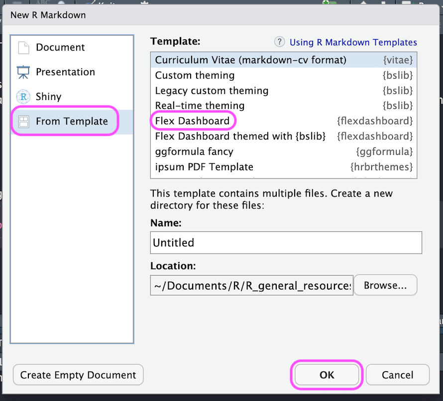
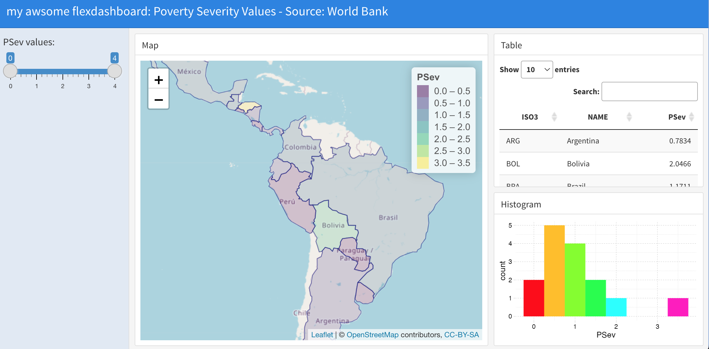

# Interactive dashboards with flexdashboard and Shiny

**Learning objectives:**

-   How to add a functionality in a dashboard by combining flexdashboard with Shiny

## Packages:

-   [flexdashboard](https://pkgs.rstudio.com/flexdashboard/index.html)

-   [shinydashboard](https://rstudio.github.io/shinydashboard/)


> Standard flexdashboards are stand-alone documents, adding Shiny to flexdashboard we create interactive documents.


### We start making a **flexdashboard**:

```{r}
library(flexdashboard)
```

**go to:**

-   file \> new file \> R markdown \> From Template \> Flex Dashboard

<center>{width="50%"}</center>

**customize it:**

      runtime: shiny

<center>{width="50%"}</center>

<center>credits: [article](https://towardsdatascience.com/create-an-interactive-dashboard-with-shiny-flexdashboard-and-plotly-b1f025aebc9c)</center>

## Build an awesome flexdadhboard

Here we build our awesome flexdadhboard with shiny using the data from the World Bank: <https://datacatalog.worldbank.org/>


### Download the data


To download the data from the World Bank we need {wbstats} package.

```{r eval=TRUE}
library(wbstats)
# wbdatacatalog()
# https://datacatalog.worldbank.org/
```

This function helps locating the data from the database, we need to specify the language of the data.

    ?wb_cache

```{r eval=FALSE}
list <- wb_cache("en")
```

<center>{width=50%}</center>

```{r eval=FALSE}
indicators <- list$indicators
```

```{r eval=TRUE,echo=FALSE}
# save(indicators,file="data/indicators.RData")
load("data/indicators.RData")
```

Selecting **PM25** we can retrieve the data used in the book.

```{r message=FALSE, warning=FALSE, paged.print=FALSE}
library(tidyverse)

indicators%>%
  filter(str_detect(indicator_id,"PM25"))
```

But, for making our flexdashboard we select other data, this data contains information about **Poverty Severity Values**, the amount of low wages which range from 0.00usd to 4.00usd a day, in specific countries of the South America.

```{r}
# select this indicator id:

# 1.1.PSev.1.90usd
# Poverty Severity ($1.90 a day)-Rural


indicators%>%
  filter(str_detect(indicator,"Severity"))%>%
  head(3)
```

We can select a specific year with `wb_data()`
```{r eval=FALSE}
p <- wb_data(indicator = "1.0.PSev.1.90usd")

p %>%count(date)
```


Then we can download the data for chosen year:
```{r}
p_14_190 <- wb(indicator = "1.0.PSev.1.90usd",
                startdate = 2014, 
                enddate = 2014)
p_14_250 <- wb(indicator = "1.0.PSev.2.5usd",
                startdate = 2014, 
                enddate = 2014)

p_14_4uds <- wb(indicator = "1.0.PSev.Poor4uds",
                startdate = 2014, 
                enddate = 2014)


p_14 <- dplyr::bind_rows(p_14_190,p_14_250,p_14_4uds)
p_14%>%head
```


### Build the map

We can use this data to build our map:
```{r}
library(rnaturalearth)

map <- ne_countries()
names(map)[names(map) == "iso_a3"] <- "ISO3"
names(map)[names(map) == "name"] <- "NAME"

map$PSev <- p_14[match(map$ISO3, p_14$iso3c), "value"] 

map$PSev <- round(map$PSev,4)
```

```{r}
library(leaflet)

pal <- colorBin(
  palette = "viridis", 
  domain = map$PSev,
  bins = seq(0, 3.5, by = 0.5)
)


  leaflet(map) %>%
    addTiles() %>%
    setView(lng = -70, lat = -10, zoom = 3) %>%
    addPolygons(stroke = TRUE,
                weight = 1,
      fillColor = ~ pal(PSev),
      color = ~ pal(PSev),
      fillOpacity = 0.2,
      # label = ~labels,
      highlight = highlightOptions(
        color = "black",
        bringToFront = TRUE
      )
    ) %>%
    leaflet::addLegend(na.label = "Na",
      pal = pal, values = ~PSev,
      opacity = 0.5, title = "PSev"
    )
```

Our awesome flexdashboard will look like this:
<center></center>


## Add some features with Shiny 

Build a **slider**, this cannot be run, it needs to be inside the shiny app/flexdashboard.

```{r eval=FALSE}
minvalue <- floor(min(map$PSev, na.rm = TRUE))
maxvalue <- ceiling(max(map$PSev, na.rm = TRUE))

sliderInput("rangevalues",
  label = "PSev values:",
  min = minvalue, max = maxvalue,
  value = c(minvalue, maxvalue)
)
```


### Add a table


And add a table and wrap it into a `div()` function with the option for resizing the font-size.
```{r eval=FALSE}
div(renderDT({
  DT::datatable(mapFiltered()@data[, c("ISO3", "NAME", "PSev")],
    rownames = FALSE, 
    options = list(pageLength = 10)
  )
}),style = "font-size:80%")
```   


### Make the histogram

To color the bins, we need to know how many bins are in our histogram, in this case we use `ggplot_build()` function:
```{r message=FALSE, warning=FALSE, paged.print=FALSE}
### Histogram
library(ggplot2)

gg_b <- ggplot_build(
  ggplot() + geom_histogram(aes(x = map$PSev), binwidth=0.5)
)
gg_b$data 
```
```{r message=FALSE, warning=FALSE, paged.print=FALSE}
gg_b$plot
```

```{r}
nu_bins <- dim(gg_b$data[[1]])[1]
nu_bins
```

```{r message=FALSE, warning=FALSE, paged.print=FALSE}
ggplot() +
  geom_histogram(aes(x = map$PSev),
                 binwidth=.5,
                 fill = rainbow(nu_bins))
```


## Meeting Videos

### Cohort 1

`r knitr::include_url("https://www.youtube.com/embed/URL")`

<details>

<summary>Meeting chat log</summary>

    LOG

</details>
